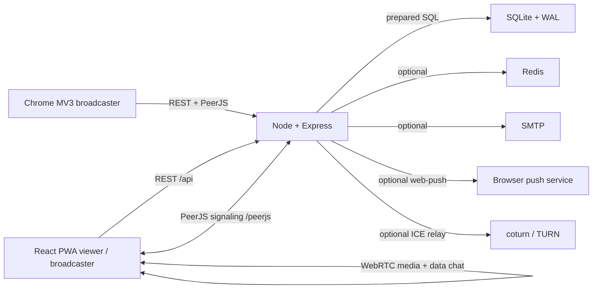
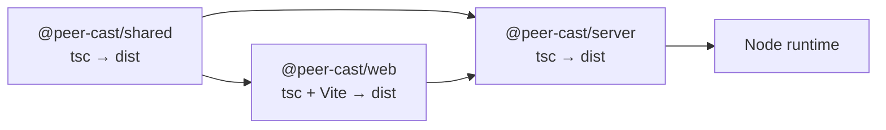
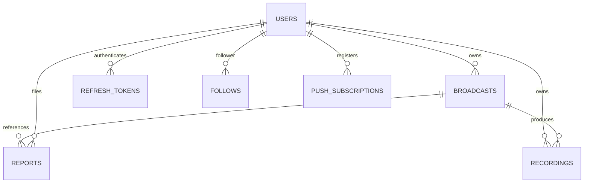
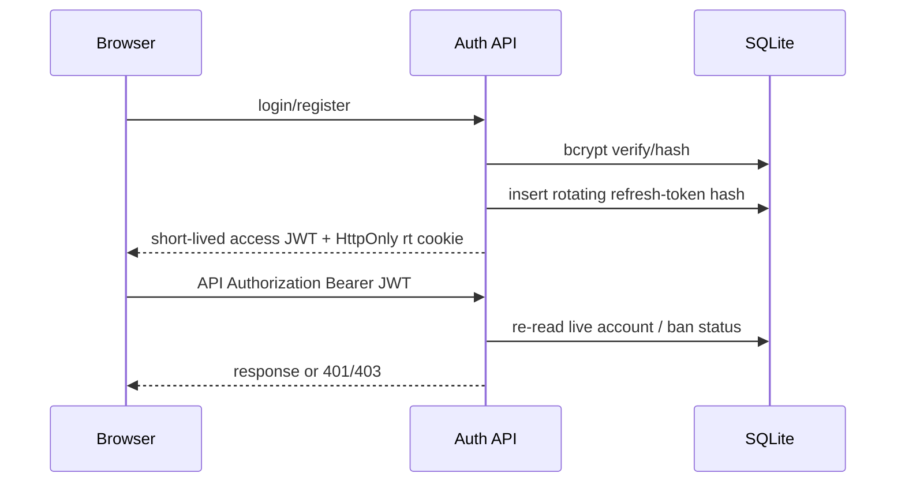
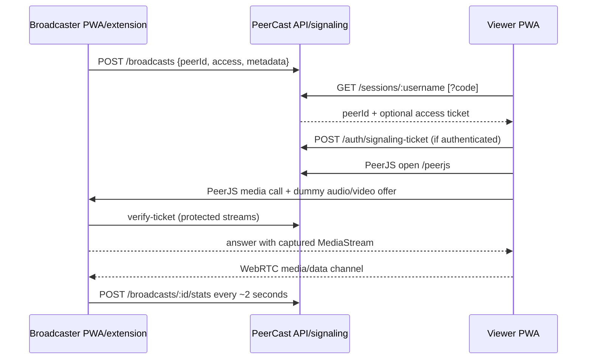
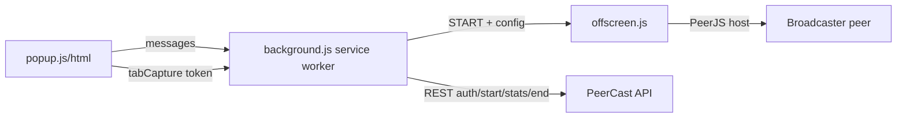

# PeerCast Project Knowledge Graph

> Current-state index for maintenance, debugging, and feature work. Generated
> from the repository source at commit `59ab636` (2026-09-17). The companion
> `project-knowledge-graph.json` contains the same core relationships in a
> machine-readable form.

## 1. System identity

PeerCast is a single-origin, self-hosted Node.js application. One Express
process owns the REST API, PeerJS signaling broker, SQLite database connection,
and production static PWA hosting. Media does **not** pass through the server:
the server authorizes a rendezvous, then WebRTC media and chat flow directly
between broadcaster and viewers.



## 2. Repository map

| Area                       | Entry points                                       | Responsibility                                                  | Change together with                          |
| -------------------------- | -------------------------------------------------- | --------------------------------------------------------------- | --------------------------------------------- |
| `packages/shared`          | `src/models.ts`, `src/api.ts`, `src/validation.ts` | Cross-package domain types, API contracts, validation constants | Server routes/repos and web RTK endpoints     |
| `packages/server`          | `src/index.ts`, `src/app.ts`                       | API, auth, persistence, signaling, static hosting               | Shared contracts, web client, deployment      |
| `packages/web`             | `src/main.tsx`, `src/App.tsx`                      | React PWA, auth UI, broadcaster, viewer, admin UI               | RTK API, shared contracts, PWA service worker |
| `packages/extension`       | `background.js`, `offscreen.js`, `popup.js`        | Optional Chrome broadcaster                                     | Server broadcast/signaling contract           |
| `tests/e2e`                | `specs/*.ts`, `playwright.config.ts`               | Built-production API/UI/WebRTC/moderation tests                 | Server and web behavior                       |
| `turn`                     | `turnserver.conf`                                  | Optional coturn relay configuration                             | `ICE_SERVERS`, `TURN_SHARED_SECRET`, firewall |
| `.github/workflows/ci.yml` | `build-test`, `deploy-oci`                         | CI gate and OCI release deployment                              | Build output, OCI service layout              |

### Build dependency direction



`npm run build` must build shared first. The web and server packages consume
the workspace-linked `packages/shared/dist` output.

## 3. Runtime topology and startup

1. `packages/server/src/index.ts` loads configuration, imports the SQLite
   singleton, promotes configured admins, starts expiry cleanup, creates the
   HTTP server, calls `configureApp()`, and listens on `HOST:PORT`.
2. `config.ts` loads root `.env` then cwd `.env`, validates production
   `JWT_SECRET`, resolves the web distribution, and derives signaling/runtime
   settings.
3. `db/index.ts` creates the database directory, opens SQLite with WAL and
   foreign keys, creates tables/indexes, then applies lightweight migrations.
4. `app.ts` installs Helmet, CORS, cookies, compression, JSON parsing,
   rate-limiters, PeerJS (when an HTTP server is supplied), API routers, static
   PWA hosting, and the final error handler.
5. In production, a reverse proxy (Caddy/nginx) terminates TLS and forwards
   both HTTP and WebSocket traffic to port `8787`.

Important runtime defaults:

| Setting             | Default            | Production concern                      |
| ------------------- | ------------------ | --------------------------------------- |
| `PORT`              | `8787`             | Reverse proxy target                    |
| `DATABASE_FILE`     | `data/peercast.db` | Must be persistent                      |
| `PUBLIC_HOST`       | `localhost`        | Must be the public signaling hostname   |
| `PUBLIC_SECURE`     | `false`            | Set `true` behind HTTPS                 |
| `SIGNAL_PATH`       | `/peerjs`          | Must match proxy/client path            |
| `SIGNAL_KEY`        | `peercast`         | PeerJS broker key                       |
| `ICE_SERVERS`       | Google STUN        | Add TURN for restrictive NATs           |
| `REGISTRATION_MODE` | `open`             | `invite`/`closed` restrict new accounts |
| `STALE_LIVE_MS`     | 90 seconds         | Removes stale discovery sessions        |
| `CORS_ORIGINS`      | `*`                | Narrow in cross-origin deployments      |

## 4. Domain and persistence graph



### SQLite tables

| Table                 | Key fields                                                           | Lifecycle / invariants                                                 |
| --------------------- | -------------------------------------------------------------------- | ---------------------------------------------------------------------- |
| `users`               | `username_lc` PK, email unique, password hash, role, ban/email flags | Display-case username is separate from lower-case lookup key           |
| `broadcasts`          | id, owner, status, access, peer id, live stats                       | `peer_id` is live-only; ended broadcasts clear transient stats/peer id |
| `refresh_tokens`      | hash, owner, expiry                                                  | Opaque rotating tokens; raw token is only in HttpOnly cookie           |
| `tickets`             | opaque ticket, viewer, peer id, expiry                               | Short-lived viewer authorization bound to a host peer id               |
| `reports`             | target, optional broadcast, reporter, status                         | Broadcast deletion preserves report with `SET NULL`                    |
| `invites`             | code, uses, max uses, expiry, disabled                               | Consumption must remain atomic                                         |
| `email_verifications` | token, owner, expiry                                                 | Reissue revokes prior live token                                       |
| `password_resets`     | token, owner, expiry                                                 | Single-use; consumed rows are deleted                                  |
| `email_changes`       | token, owner, new email, expiry                                      | New address becomes active only after confirmation                     |
| `follows`             | follower + followed composite PK                                     | Cascades on account deletion                                           |
| `push_subscriptions`  | endpoint PK, owner, browser keys                                     | Upsert by endpoint; cascades on account deletion                       |
| `recordings`          | id, owner, optional broadcast, size/status                           | WebM chunks live under `RECORDINGS_DIR`; quota enforced                |

SQL belongs in `packages/server/src/repos`; routes should call repository
methods rather than issuing SQL directly.

## 5. API route index

All REST routes are mounted below `/api`. Zod schemas validate request bodies
and selected query values. `requireAuth` re-reads the live user row, so bans
take effect even while an access JWT remains unexpired.

| Method              | Path                                            | Auth           | Handler / purpose                              |
| ------------------- | ----------------------------------------------- | -------------- | ---------------------------------------------- |
| GET                 | `/health`                                       | public         | Liveness                                       |
| GET                 | `/config`                                       | public         | Runtime signaling, version, registration mode  |
| POST                | `/auth/register`                                | public         | Create account, issue access + refresh session |
| POST                | `/auth/login`                                   | public         | Authenticate and issue session                 |
| POST                | `/auth/refresh`                                 | refresh cookie | Rotate refresh token                           |
| POST                | `/auth/logout`                                  | auth           | Consume current refresh token                  |
| POST                | `/auth/logout-all`                              | auth           | Revoke all refresh tokens                      |
| POST                | `/auth/signaling-ticket`                        | auth           | Opaque WebSocket auth ticket                   |
| POST/GET            | `/auth/send-verification`, `/auth/verify-email` | auth/public    | Email verification                             |
| POST                | `/auth/forgot-password`                         | public         | Non-enumerating reset request                  |
| POST                | `/auth/reset-password`                          | public         | Consume reset token and set password           |
| POST                | `/auth/change-email`                            | auth           | Start email change                             |
| GET/PUT/DELETE      | `/users/me`                                     | auth           | Profile, update, delete account                |
| GET/PUT             | `/users/me/settings`                            | auth           | Broadcast defaults/discoverability             |
| PUT                 | `/users/me/password`                            | auth           | Change password                                |
| GET                 | `/users/search`, `/users/:username`             | public         | Directory/profile discovery                    |
| GET/POST/DELETE     | `/users/:username/follow*`                      | mixed/auth     | Follow graph                                   |
| GET                 | `/broadcasts/live`                              | public         | Live discovery                                 |
| GET                 | `/broadcasts/mine`                              | auth           | Owner history                                  |
| POST                | `/broadcasts`                                   | auth           | Start broadcast                                |
| POST                | `/broadcasts/:id/stats`                         | owner auth     | Heartbeat/live metrics                         |
| POST                | `/broadcasts/:id/end`                           | owner auth     | End broadcast                                  |
| GET                 | `/broadcasts/:id`                               | public         | Safe broadcast detail                          |
| GET                 | `/sessions/:username`                           | optional auth  | Access gate and peer-id resolution             |
| POST                | `/sessions/verify-ticket`                       | public         | Host-side ticket verification                  |
| POST                | `/reports`                                      | mixed          | Abuse report creation                          |
| GET/POST/DELETE     | `/push/*`                                       | auth           | VAPID key/subscription lifecycle               |
| GET/POST/PUT/DELETE | `/recordings*`                                  | auth/owner     | Recording metadata, chunk upload, finalize     |
| `*`                 | `/admin/*`                                      | admin          | Moderation, invites, metrics                   |

PeerJS signaling is mounted separately at the configured `SIGNAL_PATH` (default
`/peerjs`) and uses WebSocket upgrade handling in
`server/src/signaling/peerServer.ts`.

## 6. Authentication and authorization graph



Access model:

- `Public`: `/sessions/:username` returns the current `peerId`; host accepts
  the call as `"Viewer"`.
- `Authenticated`: resolution requires a valid account and returns a
  peer-bound five-minute ticket.
- `Code`: resolution requires the access code and returns a peer-bound ticket;
  anonymous code viewers are supported.
- Host-side `BroadcastHost` verifies each media/data connection. Resolution
  alone is not sufficient for protected streams.
- Signaling auth is separate: authenticated clients mint a short-lived opaque
  signaling ticket rather than putting the JWT in the WebSocket URL.
- Admin endpoints chain `requireAuth` and `requireAdmin`.

## 7. Broadcast and WebRTC flow



Key implementation points:

- `web/src/lib/peer.ts` owns PeerJS options, ICE setup, viewer dummy stream,
  host verification, chat sanitization, connection lifecycle, and bitrate
  sampling.
- The viewer dummy stream includes video and preferably silent audio so the
  offer has matching SDP media sections.
- `BroadcastPage.tsx` owns capture selection, host construction, start/end API
  calls, stats heartbeat, and capture cleanup. Desktop capture uses
  `getDisplayMedia`; mobile capture uses `getUserMedia` with `camera`,
  `camera-only`, or `microphone` modes.
- Live mobile camera switching acquires a replacement track with the opposite
  `facingMode`, then `BroadcastHost.replaceVideoTrack()` replaces the outgoing
  video sender track for every connected viewer before stopping the old track.
- The `CaptureSource` contract is shared by `packages/shared`, validated by
  `server/src/routes/broadcasts.ts`, and persisted as broadcast metadata.
- `ViewerPage.tsx` resolves the session, mints signaling auth, attaches the
  remote stream, and retries after close with exponential backoff.
- Media never traverses Express or SQLite.
- `peerId` must stay absent from discovery/profile/detail responses and only
  appear after session access checks.

## 8. Web application graph

### Routes and guards

| Route                                   | Component          | Guard                    |
| --------------------------------------- | ------------------ | ------------------------ |
| `/`                                     | `LandingPage`      | public                   |
| `/login`                                | `LoginPage`        | public                   |
| `/register`                             | `RegisterPage`     | public                   |
| `/verify-email`, `/verify-email-change` | verification pages | public                   |
| `/forgot-password`, `/reset-password`   | recovery pages     | public                   |
| `/watch/:username`                      | `ViewerPage`       | public with access gates |
| `/dashboard`                            | `DashboardPage`    | `ProtectedRoute`         |
| `/broadcast`                            | `BroadcastPage`    | `ProtectedRoute`         |
| `/settings`                             | `SettingsPage`     | `ProtectedRoute`         |
| `/admin`                                | `AdminPage`        | `AdminRoute`             |
| `/404` and wildcard                     | `NotFoundPage`     | public                   |

### State and data

- `store/authSlice.ts`: access JWT and cached `SelfUser`; persisted local
  storage state is used to decide whether refresh should be attempted.
- `store/api.ts`: RTK Query endpoint registry, auth header injection,
  transparent refresh on 401, cache tags, and all REST client contracts.
- `store/broadcastSlice.ts`: local broadcast lifecycle/UI state.
- `store/toastSlice.ts`: global notification queue.
- `main.tsx`: bootstraps Redux, refresh behavior, service-worker registration,
  and browser router.
- `sw.ts`: Workbox precache/navigation fallback; excludes API and PeerJS from
  SPA fallback and claims clients after activation.

### PWA update invariant

Hashed assets plus `Cache-Control: no-cache` for `index.html` and `sw.js`
allow automatic downloads. An already-running page continues executing its
old bundle. Broadcasters must end/reload before starting a new session after a
deployment; an active broadcast should not be force-reloaded.

## 9. Extension graph



- `popup.js`: login, server URL, broadcast metadata, capture controls.
- `background.js`: persistent auth/session state, message routing, tab capture
  token creation, REST calls, offscreen document lifecycle.
- `offscreen.js`: capture stream, PeerJS host, ticket verification, stats.
- `lib/api-client.js`: global `PeerCastApi` compatible with both
  `importScripts` and ordinary script loading.
- `manifest.json`: MV3 permissions for tab capture, desktop capture, storage,
  offscreen documents, and optional HTTP/HTTPS hosts.

## 10. Deployment and operations

### CI/CD graph

```mermaid
flowchart LR
  Push["merge/push master"] --> CI["build-test"]
  CI -->|success only| Deploy["deploy-oci"]
  Deploy --> Package["build + tar release"]
  Package --> SSH["SCP/SSH OCI"]
  SSH --> Activate["npm ci --omit=dev + rebuild better-sqlite3"]
  Activate --> Restart["systemctl restart peercast"]
  Restart --> Health["localhost:8787/api/health"]
  Health -->|failure| Rollback["restore previous release"]
```



`deploy-oci` is limited to successful pushes on `master`; pull requests run
verification only. Releases are stored under `/opt/peercast-releases`, the
active app is `/opt/peercast-app`, and persistent data is
`/opt/peercast-data`. The OCI deployment uses SSH secrets
`OCI_HOST`, `OCI_USER`, `OCI_SSH_PRIVATE_KEY`, and `OCI_KNOWN_HOSTS`.

### Container graph

`Dockerfile` builds shared → web → server in a Node 22 build stage, then copies
only runtime artifacts and dependencies into an unprivileged Node 22 runtime.
`docker-compose.yml` persists `/data`, exposes `8787`, and optionally starts
coturn with the `turn` profile.

### Operational checks

```bash
npm run build
npm run typecheck
npm test
npm -w @peer-cast/extension run check
npx prettier --check .
npm run test:e2e
curl -fsS https://<host>/api/health
curl -fsS https://<host>/api/config
```

## 11. Debugging index

| Symptom                 | First inspect                                                                | Likely boundary           |
| ----------------------- | ---------------------------------------------------------------------------- | ------------------------- |
| Blank/old PWA           | `app.ts` cache headers, browser `index.html` and hashed asset                | Service worker/deployment |
| No live card            | `/api/broadcasts/live`, `broadcastsRepo.listLive`, stale heartbeat           | Broadcast lifecycle       |
| Session has no peer id  | `sessions.ts`, access policy, auth/cookie state                              | Authorization gate        |
| Viewer stuck connecting | Both browser consoles, PeerJS `/peerjs`, `peer.ts` call errors and ICE state | WebRTC/signaling/NAT      |
| Host accepts no viewer  | `BroadcastPage.tsx` verifier and `BroadcastHost.handleCall`                  | Two-gate access           |
| Stats freeze            | host sampling, `/broadcasts/:id/stats`, stale timeout                        | Heartbeat                 |
| Login loops             | `authSlice`, RTK reauth, refresh cookie path/SameSite                        | Session transport         |
| Push missing            | `/push/vapid-key`, browser permission, VAPID env, `lib/push.ts`              | Push integration          |
| Recording fails         | `recordings.ts`, quota/path checks, filesystem volume                        | Upload/storage            |
| Admin page 403          | live role in `middleware/auth.ts`, `AdminRoute`, role endpoint               | Authorization             |

For a WebRTC incident, capture both sides: PeerJS `error`, media call
`error/close`, `RTCPeerConnection.connectionState`, `iceConnectionState`,
`signalingState`, WebSocket failures, loaded asset hash, and `/api/config`.
Do not log JWTs, refresh cookies, access tickets, or password-reset URLs.

## 12. Test coverage map

| Test                              | Main contract                                 |
| --------------------------------- | --------------------------------------------- |
| `server/test/auth.test.ts`        | Registration, login, rotation, auth guards    |
| `access.test.ts`                  | Public/member/code access and peer-id secrecy |
| `broadcasts.test.ts`              | Start/end/stats ownership and history         |
| `admin.test.ts`                   | Ban, takedown, role, report, delete behavior  |
| `invites.test.ts`                 | Registration mode and invite consumption      |
| `email.test.ts`                   | Verification/reset/change-email lifecycle     |
| `notifications.test.ts`           | Follow and push subscription behavior         |
| `recordings.test.ts`              | Chunking, finalize, ranges, quotas, deletion  |
| `turn.test.ts`                    | TURN credential/config generation             |
| `web/src/lib/peer.test.ts`        | Chat packing, attribution, sanitization       |
| `web/src/store/authSlice.test.ts` | Auth persistence and token rotation           |
| `tests/e2e/specs/app.spec.ts`     | UI, registration, discovery, real P2P video   |
| `moderation.spec.ts`              | Ban and signaling eviction                    |
| `signaling.spec.ts`               | Raw two-peer PeerJS/WebRTC path               |

## 13. Safe change checklist

1. Update shared types/contracts first when an API shape changes.
2. Keep SQL in repositories and preserve lower-case username normalization.
3. Preserve the two-gate model: server resolution plus host-side verification.
4. Never expose `peerId` through discovery/profile/detail serializers.
5. Keep refresh tokens HttpOnly and short-lived access JWTs out of URLs/logs.
6. Add or update focused server/web tests, then run the relevant E2E flow.
7. Build shared before web/server typechecking or development.
8. For PWA changes, verify service-worker behavior and reload semantics.
9. For extension changes, run the extension syntax check and test popup →
   background → offscreen messages.
10. For production changes, merge to `master`, watch CI, verify health/config,
    then restart/reopen broadcaster pages before WebRTC testing.
